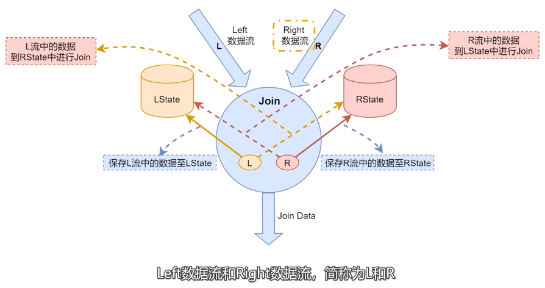

# 底层原理简介

- LState:存储左边数据流中的数据。
- RState：存储右边数据流中的数据。
- 当左边数据流数据到达的时候会保存到LState，并且到RState中进行Join。将Join生成的结果数据发送到下游。
- 右边数据流中数据到达的时候，会保存到RState当中，并且到LState中进行Join，然后将Join之嚄胡的结果数据发送到下游。

为了保障左右两边流中需要Join的数据出现在相同节点，Flink SQL会利用Join中的on的关联条件进行分区，把相同关联条件
的数据分发到同一个分区里面。

# 普通双流Join 

现有订单表A和支付表B进行关联得到汇总表C。订单表和支付表初始数据如下：

表A：订单表数据
| order_id | timestamp|
|---|--|
|  1001 | 2023-02-04 10:00:00 |
| 1002 | 2023-01-04 10:01:02 |

表B：支付表数据

| order_id |  pay_money |
|---|---|
| order_id |  pay_money |
| 1001 | 80 |
| 1002 | 100 |

## inner join

当A表中每一条数据到达时，都会和B表中的数据进行关联：
- 当能够关联到数据时，将结果输出到结果表里面；
- 当不能关联到数据时，不会将结果输出到结果表里面；

所以上述A表和B表的Join结果为：

| order_id | timestamp | pay_money |
|--- |--- |--- |
| 1002 | 2023-01-04 10:01:02 | 100 |

当表B中1001新数据到达时，新数据如下所示:

| order_id |  pay_money |
|---|---|
| order_id |  pay_money |
| 1001 | 80 |

此时结果表的数据为:

| order_id | timestamp | pay_money |
|--- |--- |--- |
| 1002 | 2023-01-04 10:01:02 | 100 |
| 1001 | 2023-02-04 10:00:00 | 80 |

***注意***

Inner Join 不会产生回撤流。

## left join

当A表数据到达时会主动和B表中数据进行关联查询，没有关联到数据。也会输出结果，缺失的字段使用null进行补全。

B表中的数据1002到达之后且A表中的数据1001和1002已经到达，关联之后表C的数据如下:

| order_id | timestamp | pay_money |
|--- |--- |--- |
| 1001 | 2023-02-04 10:00:00 | null |
| 1002 | 2023-01-04 10:01:02 | 100 |

当B表中数据1001到达之后，也会主动和表A中的数据进行关联，如果表中的数据已经输出过结果了且缺失字段为null，此时
会产生一个回撤流，将之前输出的数据会撤掉-D，在重新输出完整的数据+I。

| order_id | timestamp | pay_money | / | 
|--- |--- |--- |---|
| 1001 | 2023-02-04 10:00:00 | null |  +I|
| 1002 | 2023-01-04 10:01:02 | 100 | +I |
| 1001 | 2023-02-04 10:00:00 | null | -D |
| 1001 | 2023-02-04 10:00:00 | 80 | +I |

***注意***

left Join会产生回撤流。

## Right Join 

当表B中1001到达时，A表中的数据没有到达，则还是会输出数据，缺失字段使用null代替。当表B中数据1002到达时，A表中的
数据1002已经到达此时可以关联到数据，关联结果如下：

| order_id | timestamp | pay_money |
|--- |--- |--- |
| 1001 | null | null |
| 1002 | 2023-01-04 10:01:02 | 100 |

当表A中数据1001到达时，会主动到B表中进行关联，此时结果中已经输出过关于1001的数据，此时会产生一个回撤流。

| order_id | timestamp | pay_money | / |
|--- |--- |--- | ---|
| 1001 | null | null  | +I|
| 1002 | 2023-01-04 10:01:02 | 100 | +I |
| 1001 | null | null | -D |
| 1001 | 2023-02-04 10:00:00 |  80 | +I |

***注意***

Right Join会产生回撤流。

## Full Join

当表B中数据1001先到达时，会主动到A表中进行关联查询，关联不到数据，还是会输出结果。

当表A中数据到达时，会主动和B表中的数据进行关联查询，此时B表中只有1001的数据，灌篮不到数据，还是会输出结果。

所以此时关联结果如下：

| order_id | timestamp | pay_money |
|--- |--- |--- |
| 1001 | null | null |
| 1002 | 2023-01-04 10:01:02 | null |

当表A中的1001到达时，会和B表进行关联查询，当表B的1002到达时，会和表A进行关联查询，此时结果如下：

| order_id | timestamp | pay_money | / |
|--- |--- |--- | ---|
| 1001 | null | null | +I |
| 1002 | 2023-01-04 10:01:02 | null | +I |
| 1001 | null | null | -D |
| 1001 | 2023-02-04 10:00:00 | 80 | +I |
| 1002 | 2023-01-04 10:01:02 | null | -D |
| 1002 | 2023-01-04 10:01:02 | 100 |  +I |

***注意***

Full Join 会产生回撤流。

# Interval Join 

# 维表Join 

