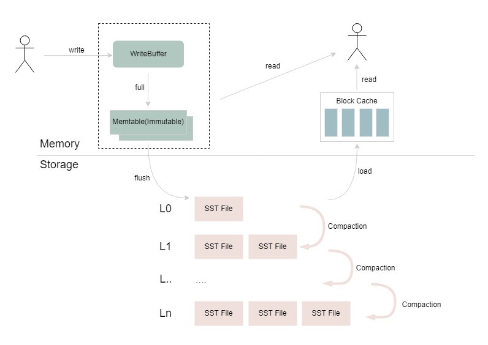
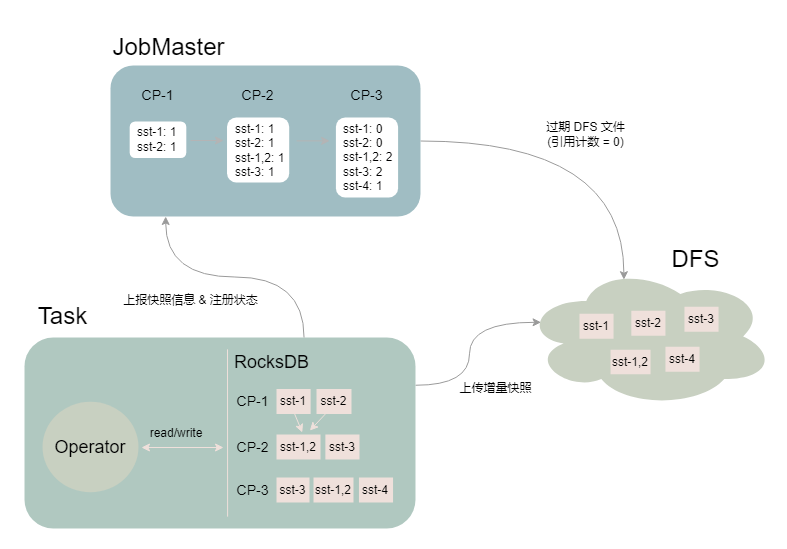
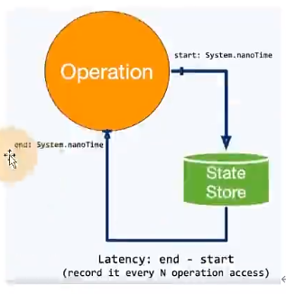
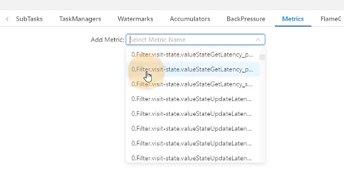
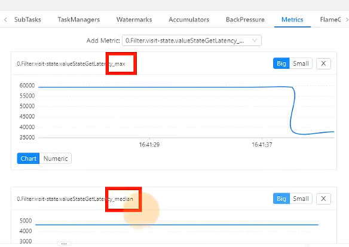

<a title="Hits" target="_blank" href="https://github.com/zeekling/hits"></a>

# RocksDB 介绍

RocksDB 是嵌入式的 Key-Value 数据库，在 Flink 中被用作 RocksDBStateBackend 的底层存储。如下图所示，RocksDB 持久化的 SST
文件在本地文件系统上通过多个层级进行组织，不同层级之间会通过异步 Compaction 合并重复、过期和已删除的数据。在 RocksDB 的
写入过程中，数据经过序列化后写入到 WriteBuffer，WriteBuffer 写满后转换为 Immutable Memtable 结构，再通过 RocksDB 的
flush 线程从内存 flush 到磁盘上；读取过程中，会先尝试从 WriteBuffer 和 Immutable Memtable 中读取数据，如果没有找到，则会
查询 Block Cache，如果内存中都没有的话，则会按层级查找底层的 SST 文件，并将返回的结果所在的 Data Block 加载到 Block 
Cache，返回给上层应用。




# RocksDBKeyedStateBackend增量快照介绍

这里介绍一下大家在大状态场景下经常需要调优的 RocksDBKeyedStateBackend 增量快照。RocksDB 具有 append-only 特性，Flink 利
用这一特性将两次 checkpoint 之间 SST 文件列表的差异作为状态增量上传到分布式文件系统上，并通过 JobMaster 中的 
SharedStateRegistry 进行状态的注册和过期。



如上图所示，Task 进行了 3 次快照（假设作业设置保留最近 2 次 Checkpoint）：
- CP-1：RocksDB 产生 sst-1 和 sst-2 两个文件，Task 将文件上传至 DFS，JM 记录 sst 文件对应的引用计数
- CP-2：RocksDB 中的 sst-1 和 sst-2 通过 compaction 生成了 sst-1,2，并且新生成了 sst-3 文件，Task 将两个新增的文件上传
  至 DFS，JM 记录 sst 文件对应的引用计数
- CP-3：RocksDB 中新生成 sst-4 文件，Task 将增量的 sst-4 文件上传至 DFS，且在 CP-3 完成后，由于只保留最近 2 次 CP，
  JobMaster 将 CP-1 过期，同时将 CP-1 中的 sst 文件对应的引用计数减 1，并删除引用计数归 0 的 sst 文件（sst-1 和 sst-2）


增量快照涉及到 Task 多线程上传/下载增量文件，JobMaster 引用计数统计，以及大量与分布式文件系统的交互等过程，相对其他的 
StateBackend 要更为复杂，在 100+GB 甚至 TB 级别状态下，作业比较容易出现性能和稳定性瓶颈的问题。


# RocksDb大状态优化


截至当前，Flink 作业的状态后端仍然只有 Memory、FileSystem 和 RocksDB 三种可选，且 RocksDB 是
状态数据量较大（GB 到 TB 级别）时的选择。RocksDB 的性能发挥非常仰赖调优，如果全部采用默认配置，读写性能有可能会很差。

但是，RocksDB 的配置也是极为复杂的，可调整的参数多达百个，没有放之四海而皆准的优化方案。如果仅考虑 Flink 状态存储这一
方面，我们仍然可以总结出一些相对普适的优化思路。本文先介绍一些基础知识，再列举方法。

## 开启State访问性能监控

flink1.13中引入了State访问的性能监控，即latency tracking state、此功能不局限于State Backend的类型，自定义实现的State 
Backend也可以复用此功能。



state访问的性能监控会产生一定的性能影响，所以默认每100次做一次抽样sample，对不同的state Backend性能损失影响不同。

对于RocksDB State Backend，性能损失大概在1%左右

对于heap State Backend，性能损失最多可达10%（内存本身速度比较快，一点损失影响就很大）

性能监控默认不开启，开启需要配置下面参数（第一个参数为开启，其他参数可根据实际情况调整）：

`state.backend.latency-track.keyed-state-enabled:true`：启用访问状态的性能监控

`state.backend.latency-track.sample-interval:100`： 采样间隔

`state.backend.latency-track.histroy-size:128`：保留的采样数据个数，越大越精确

`state.backend.latency-track.state-name-as-variable:true`：将状态名作为变量



0代表是任务编号，filter.visit-state是定义的状态的变量名。



有很多这种统计值可以查看，中位值，75分位值等。


## 开启增量CheckPoint和本地恢复


### 开启增量CheckPoint 

RocksDB是目前唯一可用于支持有状态流处理应用程序增量检查点的状态后端，可以修改参数开启增量CheckPoint：

`state.backend.incremental:true`：默认false，可以改为true。

或代码中指定 
```java
new EmbededRocksDBStateBackend(true)
```

### 开启本地恢复

当flink任务失败时，可以基于本地的状态信息进行恢复任务。可能不需要从hdfs拉取数据。本地恢复目前仅涵盖键值类型的状态后端
(RocksDB)。MemoryStateBackend不支持本地恢复并忽略此选项

`state.backend.local-recovery:true`

### 设置多目录

如果你有多块磁盘，可以考虑指定本地多目录

`state.backend.rocksdb.localdir: /data1/flink/rocksdb,/data2/flink/rocksdb,/data3/flink/rocksdb`

**注意**: 不要配置单块磁盘的多个目录，务必将目录配置到多块不同的磁盘上，让多块磁盘来分担io压力。


## 调整RockSDB的预定义选项

Flink针对不同的设置为RocksDB提供了一些预定义选项，如果调整预定义选项达不到预期，再去调整block、writebuffer等参数。

当前支持的预定义选项有支持的选项有：`DEFAULT`、`SPINING_DISK_OPTIMIZED`、`SPINNING_DISK_OPTIMIZED_HIGH_MEM`、
`FLASH_SSD_OPTIMIZED`  (有条件使用ssd的可以使用这个选项)。

我们一般使用第三个`SPINNING_DISK_OPTIMIZED_HIGH_MEM`，设置为机械硬盘+内存模式。

该模式下flink会帮我们设置一些它认为比较ok的参数(选项集合)，具体如下：

```java 
SPINNING_DISK_OPTIMIZED_HIGH_MEM(new HashMap<ConfigOption<?>, Object>() {
    private static final long serialVersionUID = 1L;
    {
      put(RocksDBConfigurableOptions.MAX_BACKGROUND_THREADS, 4);
      put(RocksDBConfigurableOptions.MAX_OPEN_FILES, -1);
      put(RocksDBConfigurableOptions.COMPACTION_STYLE, CompactionStyle.LEVEL);
      put(RocksDBConfigurableOptions.USE_DYNAMIC_LEVEL_SIZE, true);
      put(RocksDBConfigurableOptions.TARGET_FILE_SIZE_BASE, MemorySize.parse("256mb"));
      put(RocksDBConfigurableOptions.MAX_SIZE_LEVEL_BASE, MemorySize.parse("1gb"));
      put(RocksDBConfigurableOptions.WRITE_BUFFER_SIZE, MemorySize.parse("64mb"));
      put(RocksDBConfigurableOptions.MIN_WRITE_BUFFER_NUMBER_TO_MERGE, 3);
      put(RocksDBConfigurableOptions.MAX_WRITE_BUFFER_NUMBER, 4);
      put(RocksDBConfigurableOptions.BLOCK_CACHE_SIZE, MemorySize.parse("256mb"));
      put(RocksDBConfigurableOptions.BLOCK_SIZE, MemorySize.parse("128kb"));
      put(RocksDBConfigurableOptions.USE_BLOOM_FILTER, true);
    }
  })
```

可以在提交任务时指定(磁盘+内存)：

`state.backend.rocksdb.predefined-options:SPINNING_DISK_OPTIMIZED_HIGH+MEN `

也可以在代码中指定：

```java 
EmbededRocksDBStateBackend embededRocksDBStateBackend = new EmbededRocksDBStateBackend();
EmbededRocksDBStateBackend,setPredefinedOptions(PredefinedOptions.SPINNING_DISK_OPTIMIZED_HIGH_MEM);
env.setStateBackend(embeddedRocksDBStateBackend); 
```

## 增大block缓存

整个RocksDB共享一个block cache，读数据时内存的cache大小，该参数越大读数据时缓存命中率越高，默认大小为8MB，建议设置到64~256MB 。

`state.backend.rocksdb.block.cache-size: 64m`： 默认为8m。

## 增加write_buffer和level阈值大小

RocksDB中，每个State使用一个Column Family，每个Column Family使用独占的write buffer， 默认64MB，建议调大。

调整这个参数通常要适配L1层的大小阈值`max-size-level-base`，默认256m。

该值太小惠造成能存放的SST文件过少，层数变多造成查找困难，太大会造成文件过多，合并困难。建议设为
`target_file_size_base（默认为64MB）`的倍数。且不能太小，例如5-10倍，即320~640MB。

`state.backend,rocksdb.writebuffer.size: 128m`

`state.backend.rocksdb.compaction.level.max-size-level-base: 320m`


## 增大write buffer数量

每个Column Family对应的write buffer最大数量，实际上时内存中只读内存表的最大数量，默认值为2，对于机械磁盘来讲，如果内存
足够大，可以调整到5左右。

`state.backend.rocksdb.writebuffer.count: 5`


## 增大后台线程数和write buffer阈值大小

### 增大线程数

用于后台flush和合并sst文件的线程数，默认为1.建议调大，机械硬盘用户可以改为4等更大的值：

`state.backend,rocksdb.thread.num: 4`

### 增大write buffer最小合并数

将数据从write buffer中flush到磁盘时，需要合并的write buffer最小数量。默认为1，可以调整为3.

`state.backend.rocksdb.writebuffer.number-to-merge: 3`


## 开启分区索引功能

Flink 1.13 中对 RocksDB 增加了分区索引功能 ，复用了 RocksDB 的 partitioned Index & filter 功能，简单来说就是对 RocksDB 
的 partitioned Index 做了多级索引。

也就是将内存中的最上层常驻，下层根据需要再 load 回来，这样就大大降低了数据 Swap 竞争。线上测试中，相对于内存比较小的场
景中，性能提升 10 倍左右。如果在内存管控下 RocksDB 性能不如预期的话，这也能成为一个性能优化点。

`state.backend.rocksdb.memory.partitioned-index-filters:true `

# Checkpoint 设置

一般需求，我们的 Checkpoint 时间间隔可以设置为分钟级别 （1 ~5 分钟）。对于状态很大的任务，每次 Checkpoint 访问 HDFS 比
较耗时，可以设置为 5~10 分钟一次 Checkpoint，并且调大两次 Checkpoint 之间的暂停间隔，例如设置两次 Checkpoint 之间至少暂
停 4 或 8 分钟。同时，也需要考虑时效性的要求,需要在时效性和性能之间做一个平衡，如果时效性要求高，结合 end- to-end 时长
， 设置秒级或毫秒级。如果 Checkpoint 语义配置为EXACTLY_ONCE，那么在 Checkpoint 过程中还会存在 barrier 对齐的过程，可以
通过 Flink Web UI 的 Checkpoint 选项卡来查看 Checkpoint 过程中各阶段的耗时情况，从而确定到底是哪个阶段导致 Checkpoint 
时间过长然后针对性的解决问题。

RocksDB 相关参数在前面已说明，可以在 flink-conf.yaml 指定，也可以在 Job 的代码中调用 API 单独指定，这里不再列出。

```java 
// 使⽤  RocksDBStateBackend 做为状态后端，  并开启增量 Checkpoint
RocksDBStateBackend rocksDBStateBackend = new RocksDBStateBackend("hdfs://hadoop1:8020/flink/checkpoints", true);
env.setStateBackend(rocksDBStateBackend);
// 开启 Checkpoint ， 间隔为 3 分钟
env.enableCheckpointing(TimeUnit.MINUTES.toMillis(3));
// 配置 Checkpoint
CheckpointConfig checkpointConf = env.getCheckpointConfig();
checkpointConf.setCheckpointingMode(CheckpointingMode.EXACTLY_ONCE); // 最小间隔 4 分钟
checkpointConf.setMinPauseBetweenCheckpoints(TimeUnit.MINUTES.toMillis(4)); // 超时时间  10 分钟
checkpointConf.setCheckpointTimeout(TimeUnit.MINUTES.toMillis(10));
// 保存 checkpoint
checkpointConf.enableExternalizedCheckpoints(CheckpointConfig.ExternalizedCheckpointCleanup.RETAIN_ON_CANCELLATION);
```

