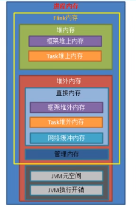
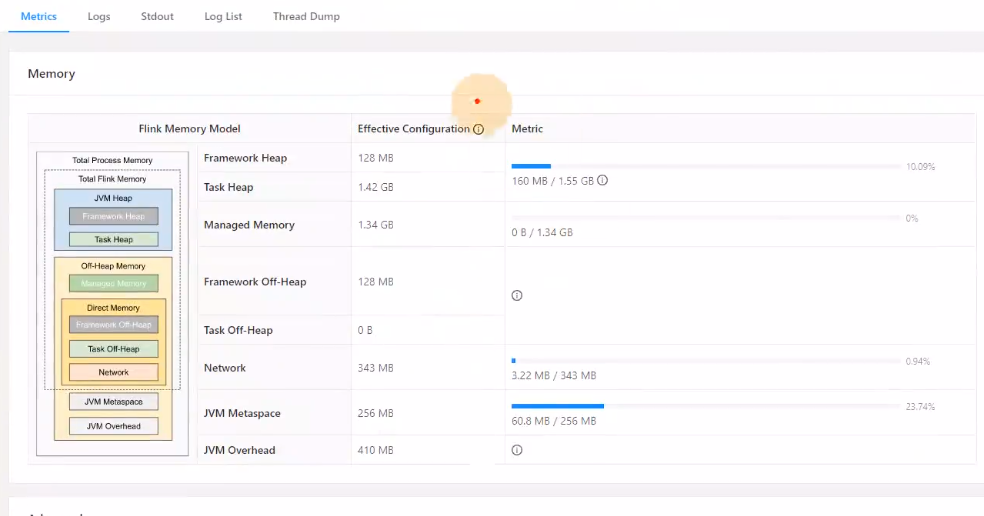

# 内存设置

## TaskManager 内存模型

TaskManager的内存模型如下图所示(1.10之后版本内存模型)：



Flink使用了堆上内存和堆外内存。

- Flink 框架内存使用了堆外内存和堆外内存，不计入slot资源。
- Task执行的内存使用了堆上内存和堆外内存。
- 网络缓冲内存：网络数据交换所使用的内存大小，如网络数据交换缓冲区。

框架堆外内存、Task堆外内存、网络缓冲内存都在堆外的直接内存里面。

- 管理内存：Flink堆外内存的管理，用于管理排序，hash表，缓冲中间结果以及RocksDb 状态后端的本地内存。
- JVM特有内存：JVM本身占用的内存，包括元数据和执行开销，


Flink 使用内存 = 框架堆内和堆外内存 + Task堆内和堆外内存 + 网络缓冲内存 + 管理内存。

进程内存 - Flink 内存 + JVM特有内存


### JVM特有内存详解

JVM特定内存： JVM本身使用的内存，包含JVM的metaspace和over-head

- JVM的metaspace：JVM 元空间。`taskmanager.memory.jvm-meta-space.size`，默认为256mb。
- JVM over-head执行开销：JVM 执行时自身所需要的内容，包括线程堆栈、IO、编译内存等所使用的内存。
  `taskmanager.memory.jvm-overhead.fraction`, 默认0.1 <br>
  `taskmanager.memory.jvm-overhead.min`，默认192mb <br>
  `taskmanager.memory.jvm-overhead.max`，默认1gb  <br>

` 总进程内存*fraction `,如果小于配置的min或者大于配置的max大小，则使用min/max 


### 框架内存
Flink框架，即TaskManager本身占用的内存，不计入Slot的资源中。

堆内：`taskmanager.memory.framework.heap.size` ，默认128mb。

堆外：`taskmanager.memory.framework.off-heap.size`，默认128mb。


### Task内存
Task执行用户代码所使用的内存。

堆内：`taskmanager.memory,task,heap.size`，默认none，由Flink内存扣除掉其他部分内存得到。

堆外：`taskmanager.memory,task.off-heap.size`，默认为0，表示不适用堆外内存。


### 网络内存
网络数据交换所使用的堆外内存大小，如网络数据交换缓冲区。

堆外：`taskmanager.memory.network.fraction`，默认0.1。

`taskmanager.memory.network.min`，默认为64mb。

`taskmanager.memory.network.max`，默认为1gb。

` Flink内存*fraction `,如果小于配置的min或者大于配置的max大小，则使用min/max

### 托管内存

用于RocksDB 状态后端的本地内存和批的排序、hash、缓冲中间结果。

堆外：
`taskmanager.memory.managed.fraction`,默认0.4。

`taskmanager.memory.managed.size` ，默认为none。

如果size没指定，则等于Flink内存 * fraction 。

查看TaskManager内存图，如下所示，如果内存长时间占用比例过高就需要调整Flink作业内存了。



- 如果未使用RocksDB作为状态后端，则可以将管理内存调整为0.
- 单个TaskManager内存大小为2-8G之间。


# 并行度设置
并行度的设置和具体的作业强关联。

## 全局并行度


### 并行度设置：

1. flink-conf.yml 设置
在我们提交一个Job的时候如果没有考虑并行度的话，那么Flink会使用默认配置文件中的并行度。配置如下：
```conf 
parallelism.default: 5
```
2. env级别
env的级别就是Environment级别。也就是通过Execution Environment来设置整体的Job并行度。

```java
val env = Stream...
env.setParallelism(5);
```
3. 客户端级别
如果在执行Job时候，发现代码中没有设置并行度而又不修改配置文件的话，可以通过Client来设置Job的并行度。
```bash 
./bin/flink run -p 5 ../wordCount-java*.jar 
```
-p即设置WordCount的Job并行度为5。

4. 算子级别
我们在编写Flink项目时,可能对于不同的Operator设置不同的并行度，例如为了实现读取Kafka的最高效
读取需要参考Kafka的partition的数量对并行度进行设置，在Sink时需要对于Sink的介质设置不同的并行
度。这样就会存在一个Job需要有多个并行度。这样就需要用到算子级别的并行度设置:

```java 
val env = Stream...
val text = ...
text.keyBy(XXX)
    .flatMap(XXX).setParallelism(5)  //计算时设置为5
    .addSink(XXXXX).setParallelism(1) //写入数据库时候设置为1
```

从优先级上来看:  算子级别 > env级别 > Client级别 > 系统默认级别

并行度的高级别会覆盖低级别的配置。例如在算子中设置的策略会覆盖配置文件中的parallelism。

在实际的使用中,我们需要设置合理的并行度来保证数据的高效处理，在一般情况下例如source，Sink等
可能会需要不同的并行度来保证数据的快速读取与写入负载等。


