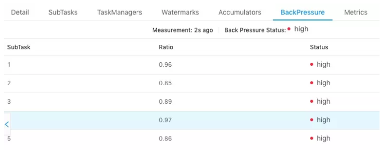

<a title="Hits" target="_blank" href="https://github.com/zeekling/hits"></a>

# 简介

反压（backpressure）是实时计算应用开发中，特别是流式计算中，十分常见的问题。反压意味着数据管道中某个节点成为
瓶颈，处理速率跟不上上游发送数据的速率，而需要对上游进行限速。由于实时计算应用通常使用消息队列来进行生产端和
消费端的解耦，消费端数据源是 pull-based 的，所以反压通常是从某个节点传导至数据源并降低数据源（比如 Kafka 
consumer）的摄入速率。

简单来说，Flink 拓扑中每个节点（Task）间的数据都以阻塞队列的方式传输，下游来不及消费导致队列被占满后，上游的
生产也会被阻塞，最终导致数据源的摄入被阻塞。


# TCP-based 反压的弊端


- 单个Task导致的反压，会阻断整个TM-TM之间的socket，连checkpoint barries也无法发出。
- 反压传播路径长，导致生效时延较大。

# Credit-based 反压

## 反压过程简介

如图所示在 Flink 层面实现反压机制，就是每一次 ResultSubPartition 向 InputChannel 发送消息的时候都会发送一个 
backlog size 告诉下游准备发送多少消息，下游就会去计算有多少的 Buffer 去接收消息，算完之后如果有充足的 Buffer 
就会返还给上游一个 Credit 告知他可以发送消息（图上两个 ResultSubPartition 和 InputChannel 之间是虚线是因为最
终还是要通过 Netty 和 Socket 去通信），下面我们看一个具体示例。


假设我们上下游的速度不匹配，上游发送速率为 2，下游接收速率为 1，可以看到图上在 ResultSubPartition 中累积了两
条消息，10 和 11， backlog 就为 2，这时就会将发送的数据 <8,9> 和 backlog = 2 一同发送给下游。下游收到了之后
就会去计算是否有 2 个 Buffer 去接收，可以看到 InputChannel 中已经不足了这时就会从 Local BufferPool 和 Network
BufferPool 申请，好在这个时候 Buffer 还是可以申请到的。

过了一段时间后由于上游的发送速率要大于下游的接受速率，下游的 TaskManager 的 Buffer 已经到达了申请上限，这时候
下游就会向上游返回 Credit = 0，ResultSubPartition 接收到之后就不会向 Netty 去传输数据，上游 TaskManager 的 
Buffer 也很快耗尽，达到反压的效果，这样在 ResultSubPartition 层就能感知到反压，不用通过 Socket 和 Netty 一层
层地向上反馈，降低了反压生效的延迟。同时也不会将 Socket 去阻塞，解决了由于一个 Task 反压导致 TaskManager 和 
TaskManager 之间的 Socket 阻塞的问题。

## 反压的理解

Flink拓扑中的每个节点（Task）间的数据都已阻塞队列的方式传输，下游来不及消费导致队列被占满后，上游生产也会被阻
塞，最终导致数据源的摄入被阻塞。

反压通常产生于这样的场景：短时间的负载高峰期导致系统接受数据的速率远高于他处理数据的速率。许多日常问题都会导
致反压，例如：垃圾回收可能会导致流入的数据快速堆积，或遇到大促销、秒杀活动导致流量暴增。


# 反压的影响

反压并不会直接影响作业的可用性，它表明作业处于亚健康的状态，有潜在的性能瓶颈并可能导致更大的数据处理延迟。通
常来说，对于一些对延迟要求不太高或者数据量比较小的应用来说，反压的影响可能并不明显，然而对于规模比较大的 
Flink 作业来说反压可能会导致严重的问题。

反压如果不能正确处理，可能会影响到checkpoint时长和state大小，甚至可能会导致资源耗尽甚至系统崩溃。

- 影响checkpoint时长：barries不会越过普通数据，数据处理会被阻塞也可能会导致checkpoint barries流经整个数据管道
  的时长变长，导致checkpoint的总时长(End to Duration)变长。
- 影响state大小：barries对齐时，接受到较快的输入管道的barries后，他后面数据会被缓存起来单不处理，直到较慢的输
  入管道的barries也到达，这些被缓存的数据会被放到state里面，导致checkpoint变大。

这两个影响对于生产环境的作业十分危险的，因为checkpoint时保证数据一致性的关键，checkpoint时间变长有可能会导致
checkpoint**超时失败**。而state大小同样可能拖慢checkpoint甚至OOM（使用Heap-based StateBackend）或者物理机内存
使用超过容器资源（使用RocksDBStateBackend）的稳定性。


# 反压定位

## Flink Web UI 自带的反压监控

Flink Web UI 的反压监控提供了 Subtask 级别的反压监控。监控的原理是通过Thread.getStackTrace() 采集在 
TaskManager 上正在运行的所有线程，收集在缓冲区请求中阻塞的线程数（意味着下游阻塞），并计算缓冲区阻塞线程数与
总线程数的比值 rate。其中，rate < 0.1 为 OK，0.1 <= rate <= 0.5 为 LOW，rate > 0.5 为 HIGH。




以下两种场景可能导致反压：

- 该节点发送速率跟不上它的产生数据速率。该场景一般是单输入多输出的算子，例如FlatMap。定位手段是因为这是从 
 Source Task 到 Sink Task 的第一个出现反压的节点，所以该节点是反压的根源节点。
- 下游的节点处理数据的速率较慢，通过反压限制了该节点的发送速率。定位手段是从该节点开始继续排查下游节点。

注意事项：

- 因为Flink Web UI 反压面板是监控发送端的，所以反压的根源节点并不一定会在反压面板体现出高反压。如果某个节点是
性能瓶颈并不会导致它本身出现高反压，而是导致它的上游出现高反压。总体来看，如果找到第一个出现反压的节点，则反
压根源是这个节点或者是它的下游节点。
- 通过反压面板无法区分上述两种状态，需要结合 Metrics 等监控手段来定位。如果作业的节点数很多或者并行度很大，即
需要采集所有 Task 的栈信息，反压面板的压力也会很大甚至不可用 。


## Flink Task Metrics 监控反压

Network和 task I/Ometrics 是轻量级反压监视器，用于正在持续运行的作业，其中一下几个 metrics 是最有用的反压指标。

| Metrics | 描述 |
|----|----|
| outPoolUsage | 发送端Buffer的使用率 |
| inPoolUsage | 接受端Buffer的使用率 |
| floatinguffersUsage(1.9以上) | 接受端floating Buffer的使用率  |
| exclusiveBuffersUsage(1.9以上) | 接受端exclusive Buffer的使用率 |


采用 Metrics 分析反压的思路：如果一个 Subtask 的发送端 Buffer 占用率很高，则表明它被下游反压限速了；如果一个
Subtask 的接受端 Buffer 占用很高，则表明它将反压传导至上游。

| / | outPoolUsage 低 | outPoolUsage 高 |
|--- |--- |---| 
| inPoolUsage 低 | 正常 | 被下游反压，处于临时情况，没传递到上游；<br>可能时反压的根源，一条输入多条输出的场景 |
| inPoolUsage 高 |  如果时上游所有outPoolUsage 都是低，<br>有可能最终可能导致反压(还没传递到上游;<br>如果时上游所有的outPoolUsage 都是高，则为反压根源) | 被下游反压。 |

inPoolUsage和outPoolUsage反压分析表

- outPoolUsage 和 inPoolUsage 同为低表明当前 Subtask 是正常的，同为高分别表明当前 Subtask 被下游反压。
- 如果一个 Subtask 的 outPoolUsage 是高，通常是被下游 Task 所影响，所以可以排查它本身是反压根源的可能性。
- 如果一个 Subtask 的 outPoolUsage 是低，但其 inPoolUsage 是高，则表明它有可能是反压的根源。因为通常反压会传
导至其上游，导致上游某些 Subtask 的 outPoolUsage 为高。


反压有时是短暂的且影响不大，比如来自某个 channel 的短暂网络延迟或者 TaskManager 的正常 GC，这种情况下可以不用处理。

outPoolUsage 与 floatingBuffersUsage 、 exclusiveBuffersUsage 的关系:

- floatingBuffersUsage 为高则表明反压正在传导至上游。
- exclusiveBuffersUsage 则表明了反压可能存在倾斜。如果floatingBuffersUsage 高、exclusiveBuffersUsage 低，则存
在倾斜。因为少数 channel 占用了大部分的 floating Buffer（channel 有自己的 exclusive buffer，当 exclusive 
buffer 消耗完，就会使用floating Buffer）


# 反压的原因及处理

注意：反压可能时暂时的，可能由于负载高峰，CheckPoint或者作业重启引起的数据积压而导致的反压。如果反压是暂时的，
应该忽略它。另外，请记住，断断续续的反压会影响我们的分析和解决问题。

定位到反压节点后，分析造成反压的原因的办法主要是观察Task Thread。按照下面顺序一步步排查。

## 使用火焰图分析

火焰图是跟踪堆栈线程然后重复多次采样而生成的。每个方法的调用都会有一个长方型表示，长方型的长度和它在采样中出
现的次数成正比。是Flink 1.13 新特性。

开启方法：
```bash 
rest.flamegraph.enabled : true
```

横向就是耗时时长，横向越长表示耗时越长。纵向表示调用栈。一般只需要看最上面函数。


## 分析GC情况

TaskManager的内存以及GC问题也会导致反压，包括TaskManager JVM 各区内存不合理导致频繁Full GC甚至失联。通常建议
使用默认的G1垃圾回收器。

打印 GC 日志的第一步，就是开启 GC 打印的参数了，也是最基本的参数。

```bash 
-XX:+PrintGCDetails -XX:+PrintGCDateStamps 
```
-D参数配置方式：

```bash 
-Denv.java.opt="-XX:+PrintGCDetails -XX:+PrintGCDateStamps"
```

## 外部交互组件

如果我们发现我们的source端数据读取性能比较低或者Sink端写入性能较差，需要检查第三方组件是否遇到瓶颈，以及做维表
join时的性能问题，也许要和外部组件交互。

关于第三方的性能问题，需要结合具体的组件来分析，最常用的思路：

1、异步IO + 热缓存来优化读写性能，减少对外部组件的访问。

2、先攒批在进行读写操作。


