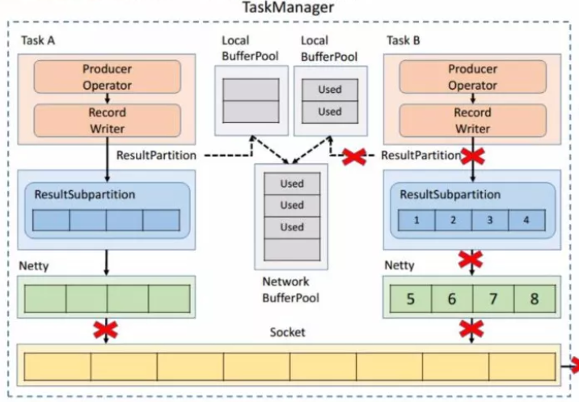
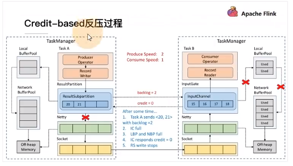

# 简介

反压（backpressure）是实时计算应用开发中，特别是流式计算中，十分常见的问题。反压意味着数据管道中某个节点成为
瓶颈，处理速率跟不上上游发送数据的速率，而需要对上游进行限速。由于实时计算应用通常使用消息队列来进行生产端和
消费端的解耦，消费端数据源是 pull-based 的，所以反压通常是从某个节点传导至数据源并降低数据源（比如 Kafka 
consumer）的摄入速率。

简单来说，Flink 拓扑中每个节点（Task）间的数据都以阻塞队列的方式传输，下游来不及消费导致队列被占满后，上游的
生产也会被阻塞，最终导致数据源的摄入被阻塞。

# TCP-based 反压的弊端

- 单个Task导致的反压，会阻断整个TM-TM之间的socket，连checkpoint barries也无法发出。
- 反压传播路径长，导致生效时延较大。

# Credit-based 反压

## 反压过程简介

如图所示在 Flink 层面实现反压机制，就是每一次 ResultSubPartition 向 InputChannel 发送消息的时候都会发送一个 
backlog size 告诉下游准备发送多少消息，下游就会去计算有多少的 Buffer 去接收消息，算完之后如果有充足的 Buffer 
就会返还给上游一个 Credit 告知他可以发送消息（图上两个 ResultSubPartition 和 InputChannel 之间是虚线是因为最
终还是要通过 Netty 和 Socket 去通信），下面我们看一个具体示例。

假设我们上下游的速度不匹配，上游发送速率为 2，下游接收速率为 1，可以看到图上在 ResultSubPartition 中累积了两
条消息，10 和 11， backlog 就为 2，这时就会将发送的数据 <8,9> 和 backlog = 2 一同发送给下游。下游收到了之后
就会去计算是否有 2 个 Buffer 去接收，可以看到 InputChannel 中已经不足了这时就会从 Local BufferPool 和 Network
BufferPool 申请，好在这个时候 Buffer 还是可以申请到的。

过了一段时间后由于上游的发送速率要大于下游的接受速率，下游的 TaskManager 的 Buffer 已经到达了申请上限，这时候
下游就会向上游返回 Credit = 0，ResultSubPartition 接收到之后就不会向 Netty 去传输数据，上游 TaskManager 的 
Buffer 也很快耗尽，达到反压的效果，这样在 ResultSubPartition 层就能感知到反压，不用通过 Socket 和 Netty 一层
层地向上反馈，降低了反压生效的延迟。同时也不会将 Socket 去阻塞，解决了由于一个 Task 反压导致 TaskManager 和 
TaskManager 之间的 Socket 阻塞的问题。

## 反压的理解

Flink拓扑中的每个节点（Task）间的数据都已阻塞队列的方式传输，下游来不及消费导致队列被占满后，上游生产也会被阻
塞，最终导致数据源的摄入被阻塞。

反压通常产生于这样的场景：短时间的负载高峰期导致系统接受数据的速率远高于他处理数据的速率。许多日常问题都会导
致反压，例如：垃圾回收可能会导致流入的数据快速堆积，或遇到大促销、秒杀活动导致流量暴增。

# 反压的影响

反压并不会直接影响作业的可用性，它表明作业处于亚健康的状态，有潜在的性能瓶颈并可能导致更大的数据处理延迟。通
常来说，对于一些对延迟要求不太高或者数据量比较小的应用来说，反压的影响可能并不明显，然而对于规模比较大的 
Flink 作业来说反压可能会导致严重的问题。

反压如果不能正确处理，可能会影响到checkpoint时长和state大小，甚至可能会导致资源耗尽甚至系统崩溃。

- 影响checkpoint时长：barries不会越过普通数据，数据处理会被阻塞也可能会导致checkpoint barries流经整个数据管道
  的时长变长，导致checkpoint的总时长(End to Duration)变长。
- 影响state大小：barries对齐时，接受到较快的输入管道的barries后，他后面数据会被缓存起来单不处理，直到较慢的输
  入管道的barries也到达，这些被缓存的数据会被放到state里面，导致checkpoint变大。

这两个影响对于生产环境的作业十分危险的，因为checkpoint时保证数据一致性的关键，checkpoint时间变长有可能会导致
checkpoint**超时失败**。而state大小同样可能拖慢checkpoint甚至OOM（使用Heap-based StateBackend）或者物理机内存
使用超过容器资源（使用RocksDBStateBackend）的稳定性。

