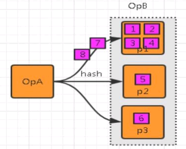
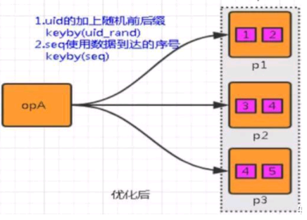
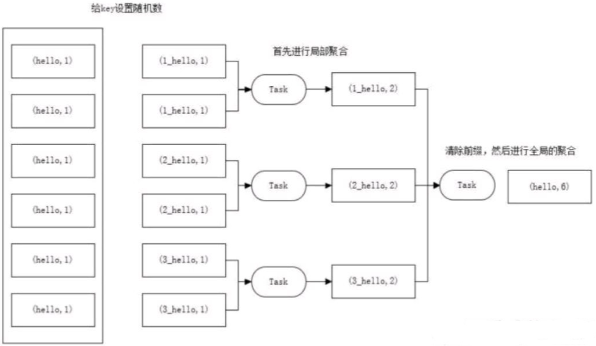

<a title="Hits" target="_blank" href="https://github.com/zeekling/hits"></a>

# 数据倾斜原理


数据倾斜就是数据的分布严重不均，流入部分算子的数据明显多余其他算子，造成这部分算子压力过大。




# 影响

## 单点问题

数据集中在某些分区上（Subtask），导致数据严重不平衡。

## GC 频繁

过多的数据集中在某些 JVM（TaskManager），使得JVM 的内存资源短缺，导致频繁 GC。

## 吞吐下降、延迟增大

数据单点和频繁 GC 导致吞吐下降、延迟增大。

## 系统崩溃

严重情况下，过长的 GC 导致 TaskManager 失联，系统崩溃。

# Flink数据倾斜问题定位

## 定位反压

定位反压有2种方式：Flink Web UI 自带的反压监控（直接方式）、Flink Task Metrics（间接方式）。通过监控反压的信息
，可以获取到数据处理瓶颈的 Subtask。

## 确定数据倾斜

Flink Web UI 自带Subtask 接收和发送的数据量。当 Subtasks 之间处理的数据量有较大的差距，则该 Subtask 出现数据倾斜。

# Flink 如何处理常见数据倾斜

## 数据源 source 消费不均匀

解决思路：通过调整并发度，解决数据源消费不均匀或者数据源反压的情况。

例如kafka数据源，可以调整 KafkaSource 的并发度解决消费不均匀。

调整并发度的原则：KafkaSource 并发度与 kafka 分区数是一样的，或者 kafka 分区数是KafkaSource 并发度的整数倍。

## key 分布不均匀的无统计场景

说明：key 分布不均匀的无统计场景，例如上游数据分布不均匀，使用keyBy来打散数据。

解决思路： 通过添加随机前缀，打散 key 的分布，使得数据不会集中在几个 Subtask。




具体措施：
① 在原来分区 key/uid 的基础上，加上随机的前缀或者后缀。
② 使用数据到达的顺序seq，作为分区的key。

## key 分布不均匀的统计场景

解决思路：聚合统计前，先进行预聚合，例如两阶段聚合（加盐局部聚合+去盐全局聚合）。



两阶段聚合的具体措施：
① 预聚合：加盐局部聚合，在原来的 key 上加随机的前缀或者后缀。
② 聚合：去盐全局聚合，删除预聚合添加的前缀或者后缀，然后进行聚合统计。


## SQL 样例

在下面SQL里面，我们统计一个网站各个端的每分钟的pv，从kafka消费过来的数据首先会按照端进行分组，然后执行聚合函
数count来进行pv的计算。

```plsql 
select 
  TUMBLE_END(proc_time, INTERVAL '1' MINUTE) as winEnd,
  plat,
  count(*) as pv  
from 
  source_kafka_table 
group by 
  TUMBLE(proc_time, INTERVAL '1' MINUTE) ,plat 
```

如果某一个端产生的数据特别大，比如我们的微信小程序端产生数据远远大于其他app端的数据，那么把这些数据分组到某一
个算子之后，由于这个算子的处理速度跟不上，就会产生数据倾斜。

```plsql 
select 
  winEnd,
  split_index(plat1,'_',0) as plat2,
  sum(pv) 
from (
  select 
    TUMBLE_END(proc_time, INTERVAL '1' MINUTE) as winEnd,
    plat1,
    count(*) as pv 
  from (
    -- 最内层，将分组的key，也就是plat加上一个随机数打散
    select 
      plat || '_' || cast(cast(RAND()*100 as int) as string) as plat1 ,
      proc_time from source_kafka_table 
  ) group by 
    TUMBLE(proc_time, INTERVAL '1' MINUTE), plat1 
) group by winEnd,split_index(plat1,'_',0)
```
在这个sql的最内层，将分组的key，也就是plat加上一个随机数打散，然后求打散后的各个分组（也就是sql中的plat1）的
pv值，然后最外层，将各个打散的pv求和。

注意：最内层的sql，给分组的key添加的随机数，范围不能太大，也不能太小，太大的话，分的组太多，增加checkpoint的
压力，太小的话，起不到打散的作用。


