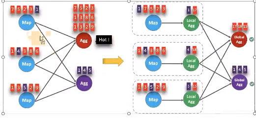
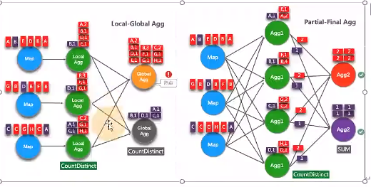

<a title="Hits" target="_blank" href="https://github.com/zeekling/hits"></a>

# 设置空闲状态保留时间

不设置空闲状态保留时间会导致状态爆炸。

- FlinkSQL 的 regular join inner 、 left 、 right ），左右表的数据都会一直保存在状态里，不会清理！要么设置 
TTL ，要么使用 Flink SQL 的 interval join 。
- 使用 Top N 语法进行去重，重复数据的出现一般都位于特定区间内（例如一小时或一天内），过了这段时间之后，对应的
状态就不再需要了。


Flink SQL可以指定空闲状态（即未更新的状态）被保留的最小时间 当状态中某个 key对应的 状态未更新的时间达到阈值时，
该条状态被自动清理。

API 设置：

```java 
tableEnv.getConfig().setIdleStateRetention(Duration.ofHours(1));
```
配置参数设置：
```java 
Configuration configuration = tableEnv.getConfig().getConfiguration();
configuration.setString("table.exec.state.ttl", " 1 h" );
```

# 开启MiniBatch


MiniBatch是微批处理，原理是 缓存一定的数据后再触发处理，以减少对 State 的访问从而提升吞吐并减少数据的输出量。MiniBatch主要依靠在每个Task上注册的Timer线程来触发微批，需要消耗一定的线程调度性能。

## 开启方式

MiniBatch 默认关闭，开启方式如下:

```java 
Configuration configuration = tEnv.getConfig().getConfiguration();
configuration.setString(" table.exec.mini batch.enabled ", true);
configuration.setString(" table.exec.mini batch.allow latency ", 5 s);
configuration.setString(" table.exec.mini batch.size ", 20000);

```

- `table.exec.mini batch.enabled`: 开启 miniBatch的参数。
- `table.exec.mini batch.allow-latency`： 批量输出的间隔时间。
- `table.exec.mini batch.size`： 防止 OOM 设置每个批次最多缓存数据的条数 ，可以设为2 万条。


注意：

- 目前上述样例中的key value 配置项仅被 Blink planner支持。
- 1.12 之前的版本有 bug ，开启 miniBatch ，不会清理过期状态，也就是说如果设置状态的 TTL ，无法清理过期状态。
1.12 版本才修复这个问题 。

参考ISSUE：https://issues.apache.org/jira/browse/FLINK_17096


## 适用场景

微批处理通过增加延迟换取高吞吐，如果有超低延迟的要求，不建议开启微批处理。通常对于聚合的场景，微批处理可以显
著的提升系统性能，建议开启。


# 开启 LocalGlobal

## 原理介绍

LocalGlobal优化将原先的 Aggregate 分成 Local+Global 两阶段聚合，即MapReduce 模型中的 Combine+Reduce 
处理模式。第一阶段在上游节点本地攒一批数据进行聚合（ localAgg ），并输出这次微批的增量值 A ccumulator ）。第
二阶段再将收到的 Accumulator 合并（ Merge ），得到最终的结果 GlobalAgg ）。


LocalGlobal本质上能够靠 LocalAgg 的聚合筛除部分倾斜数据，从而降低 GlobalAgg的热点，提升性能。结合下图理解 
LocalGlobal 如何解决数据倾斜的问题。



- 未开启 LocalGlobal 优化，由于流中的数据倾斜， Key 为红色的聚合算子实例需要处理更多的记录，这就导致了热点问题。
- 开启 LocalGlobal 优化后，先进行本地聚合，再进行全局聚合。可大大减少 GlobalAgg的热点，提高性能。

## 开启方式

- LocalGlobal 优化需要先开启 MiniBatch ，依赖于 MiniBatch 的参数。
- table.optimizer.agg phase strategy : 聚合策略。默认 AUTO ，支持参数 AUTO 、TWO_PHASE( 使用 LocalGlobal 两阶
段聚合 、 ONE_PHASE( 仅使用 Global 一阶段聚合）。


```java 
// 初始化运行环境
StreamExecutionEnvironment env = StreamExecutionEnvironment.getExecutionEnvironment();
TableEnvironment tEnv = StreamTableEnvironment.create(env);
Configuration configuration = tEnv.getConfig().getConfiguration();
// 开启 miniBatch
configuration.setString("table.exec.mini-batch.enabled ", true);
// 批量输出的间隔时间
configuration.setString("table.exec.mini-batch.allow latency ", "5s");
// 防止 OOM 设置每个批次最多缓存数据的条数 ，可以设为 2 万条
configuration.setString("table.exec.mini-batch.size ", "20000");
// 开启 LocalGlobal
config uration.setString("table.optimizer.agg-phase-strategy", "TWO_PHASE");
```

- 1) 需要先开启 MiniBatch。
- 2) 开启 LocalGlobal 需要 UDAF 实现 Merge 方法 。

# 开启Split Distinct

LocalGlobal优化针对普通聚合（例如 SUM 、 COUNT 、 MAX 、 MIN 和 AVG ）有较好的效果。对于 DISTINCT 的聚合（如 
COUNT DISTINCT 收效不明显，因为 COUNT DISTINCT 在 Local 聚合时，对于 DISTINCT KEY 的去重率不高，导致在 
Global 节点仍然存在热点。

## 原理介绍

为了解决COUNT DISTINCT 的热点问题，通常需要手 动改写为两层聚合（增加按 Distinct Key取模的打散层）。

从 Flink1.9.0 版本开始，提供了 COUNT DISTINCT 自动打散功能， 通过HASH_CODE(distinct_key) % BUCKET_NUM 打散，
不需要手动重写。Split Distinct 和LocalGlobal 的原理对比参见下图。



Distinct举例 

```sql 
SELECT 
  a,COUNT(DISTINCT b)
FROM 
  T
GROUP BY a
```

使用SQL语句手动打散：

```sql 
SELECT a,SUM(cnt)
FROM (
  SELECT a,COUNT(DISTINCT b ) as cnt
  FROM T
  GROUP BY a,MOD(HASH_CODE(b), 1024) 
)
GROUP BY a
```

## 特性开启

默认不开启，使用参数显式开启。

- `table.optimizer.distinct agg.split.enabled: true`： 默认 false 。
- `table.optimizer.distinct agg.split.bucket num: Split Distinct`： 优化在第一层聚合中，被打散的bucket 数目。默认 1024。

```java 
// 初始化 table environment
TableEnvironment tEnv = ...
// 获取 tableEnv 的配置对象
Configuration configuration = tEnv.getConfig().getConfiguration();
// 设置参数：要结合 minibatch 一起 使用
// 开启 Split Distinct
configuration.setString("table.optimizer.distinct-agg.split.enabled", "true");
// 第一层 打 散 的 bucket 数目
configuration.setString("table.optimizer.distinct-agg.split.bucket-num", "1024");
```

### 注意事项

- （1）目前不能在包含 UDAF 的 Flink SQL 中使用 Split Distinct 优化方法。
- （2）拆分出来的两个 GROUP 聚合还可参与 LocalGlobal 优化。
- （3）该功能在Flink 1.9.0 版本 及以上版本才支持。


# 多维DISTINCT 使用Filter

在某些场景下，可能需要从不同维度来统计count distinct ）的结果 （比如统计 uv 、app 端的 uv 、 web 端的 uv 可能
会使用如下 CASE WHEN 语法 。

```sql
SELECT
  a,
  COUNT(DISTINCT b ) AS total_ b,
  COUNT(DISTINCT CASE WHEN c IN ('A', 'B') THEN b ELSE NULL END) AS AB b,
  COUNT(DISTINCT CASE WHEN c IN ('C', 'D') THEN b ELSE NULL END) AS CD_b
FROM T
GROUP BY a
```

在这种情况下，建议使用FILTER 语法 , 目前的 Flink SQL 优化器可以识别同一唯一键上的不同 FILTER 参数。如，在上
面的示例中，三个 COUNT DISTINCT 都作用在 b 列上。此时，经过优化器识别后，Flink 可以只使用一个共享状态实例，
而不是三个状态实例，可减少状态的大小和对状态的访问。

将上边的CASE WHEN 替换成 FILTER 后 ，如下所示：

```sql 
SELECT
  a,
  COUNT(DISTINCT b ) AS b,
  COUNT(DISTINCT b ) FILT ER (WHERE c IN ('A', 'B')) AS AB_b,
  COUNT(DISTINCT b ) FILTER (WHERE c IN ('C', 'D')) AS CD b
FROM T
GROUP BY a
```

